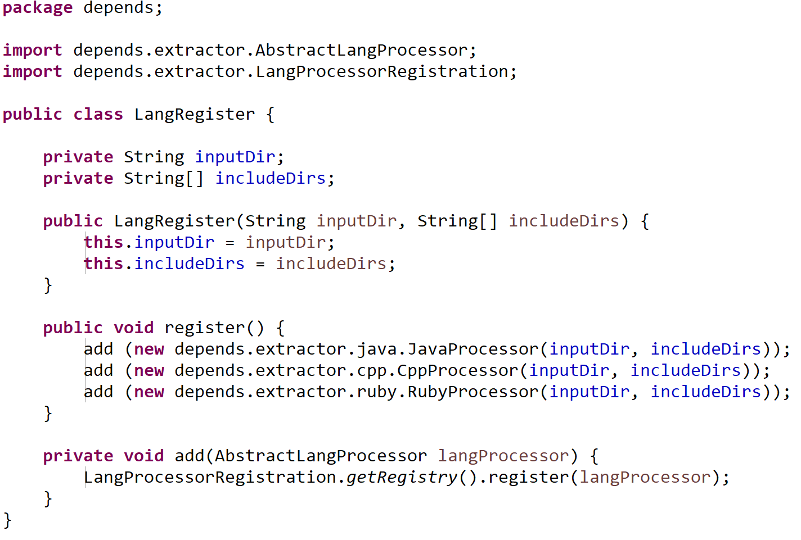
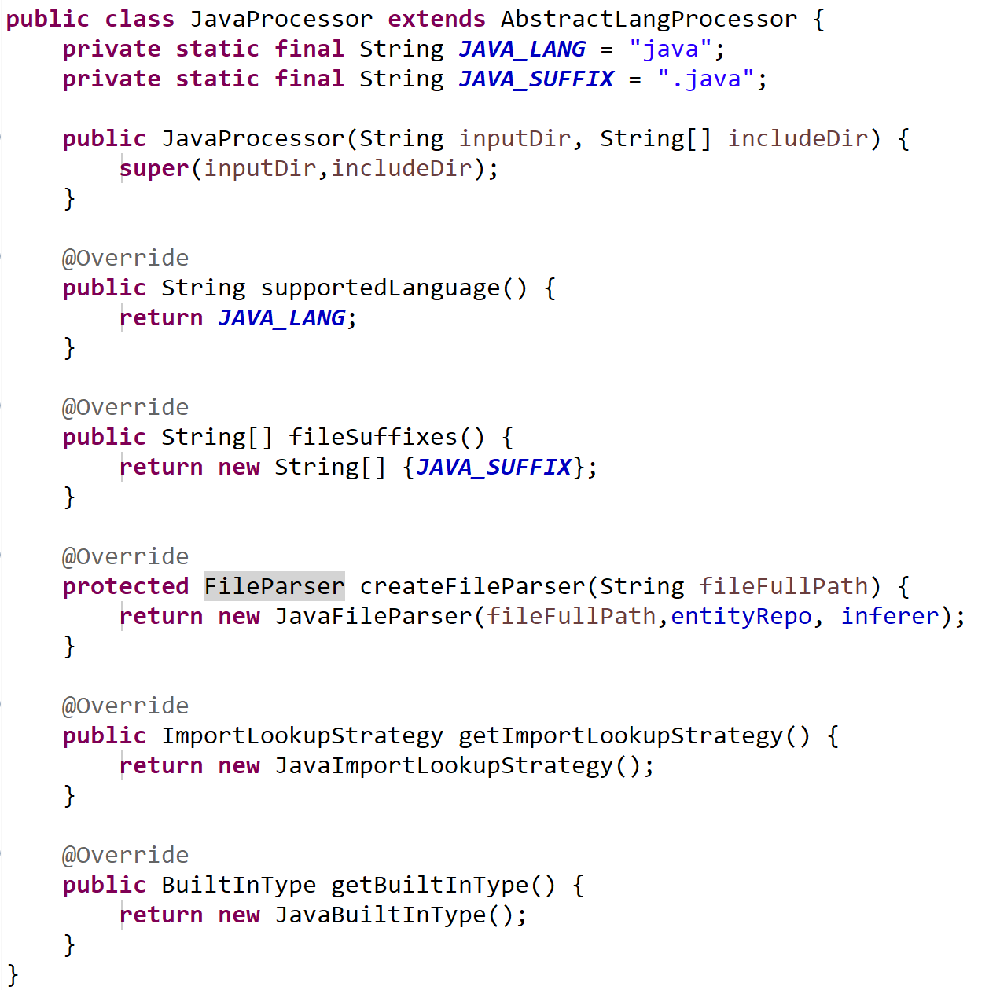
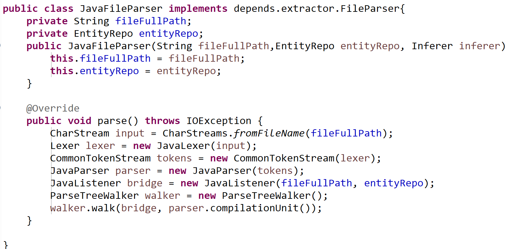

**Depends设计说明**

**v20190215 **

语言扩展说明
============

扩展一种新的语言，涉及如下方面

-   向内核注册该语言的支持

-   实现该语言的Processor

-   实现语言的Parser

-   定义Import查找策略

-   定义语言的内建类型等辅助功能

本章首先介绍上述几点。然后专门用一章来讲解语言独立部分的数据结构，接着讲解如何实现一个Parser内部的Listener或Visitor，来写入侦听到的信息。

### 注册语言支持

在LangRegister类中，增加1行，如下图所示：

{width="5.7625in" height="3.8895833333333334in"}

说明：
该处设计不够优雅，最好不必打开文件进行修改，可以进行进一步的改进。

### 实现该语言的Processor

一个语言的Processor是一个汇总入口，它描述了和一个语言的实现相关的所有内容。具体包括：

-   支持的语言的名称（字符串）

-   该语言文件的后缀名（数组，可以有多个）

-   该语言对应的文件解析器 FileParser

-   该语言对应的Import查找策略（ImportLookupStrategy）

-   该语言的内建类型（对于静态类型语言）

以Java语言为例：

{width="5.763888888888889in"
height="5.709722222222222in"}

### 语言特定的FileParser

FileParser是一个语言特定的类，命名为*Lang*FileParser，它实现FileParse接口，必须实现*parse（）*方法。

该parse方法的目标是：读入文件，调用词法解析和语法解析，构建Listener或Visitor，并将解析获得的结构信息和表达式信息正确的写入到EntityRepo中。

关于EntityRepo的存储结构，详见EntityRepo（？？）的说明。

以Java为例，FileParser的实现如下：

{width="5.763888888888889in"
height="2.8465277777777778in"}

其步骤为：
创建Lexer，创建Parse，创建Listener，开始遍历每个关心的语法元素。

### 语言特定的Import查找策略

ImportStrategy是一个策略类，命名为*Lang*ImportLookupStrategy，它继承ImportLookupStrategy接口。其的职责是负责建立起不同编译单元之间的关系。具体来说，是如何查找到位于其他编译单元的特定名字。

ImportStrategy的核心方法是lookupImportedType(String name, FileEntity
fileEntity, EntityRepo repo, Inferer inferer)。其说明如下：

How to find the corresponding entity out of current scope

**Parameters:**

> **name** - the entity name
>
> **fileEntity** - the current file
>
> **repo** - the whole entity repo, which could be used when necessary
>
> **inferer** - the inferer object, which could be used when necessary

**Returns:**

> the founded entity, or null if not found

以Java和C/C++为例。Java的实现非常简单。由于Java的import中包含了所有import进来的类，所以只需要根据后缀匹配即可发现特定的Entity。但是，C/C++的实现就比较复杂。它有可能是一个使用using的directive，这种情况和Java类似。但是，更多情况下应该去根据import的文件的情况查找文件中的symbol。

ImportStrategy还包含几个辅助的方法。其中一个是getImportedRelationEntities。该方法会返回事实上具备import关系的实体。这个方法的原因是因为通过解析器解析到的import关系并不一定是准确的。例如Java中的wildcard类型的import。

getImportedTypes和getImportedFiles方法则分别负责返回imported的类型和文件。这两个方法的具体作用仅仅是两个便利函数，并不十分必要，今后应考虑重构进行消除。

### 语言的内建类型

程序框架将不会尝试查找属于内建类型的变量，同时这也消除了依赖分析工具对于系统标准库的依赖。

BuildInType包含两种匹配方式：完全匹配和前缀匹配。完全匹配例如int,
double这类类型。而前缀匹配则包括java.lang.\*， \_\_前缀等。

需要注意，这种方式虽然便捷，但是存在一定的风险，因为并未根据符号的范围和可见性进行分析，但是可以加快速度。可以考虑在今后进行重构。

语言通用部分
============

语言通用部分包含许多功能模块，其中最重要的模块为Entity的类型定义、Entity资源库（EntityRepo）和Relation分析3个部分。

### Entity和Relation

Entity和Relation是两个核心概念，其定义如下：

、{width="5.767361111111111in"
height="2.9611111111111112in"}

虽然Entity的方法很多，但是其数据结构并不复杂。主要的属性包括:id,
rawName, qualifiedName, relation,
parent和children,以及由此形成的祖先-后代关系。

Relation更简单，仅仅包含依赖关系的类型以及指向的Entity。Relation是一个有向关系，自本Entity指向toEntity。

Entity提供了几个重要的方法。包括addRelation和inferEntities。
addRelation的职责很容易理解。
inferEntities是一个重要的方法，它负责完成自本实体开始的所有的类型的binding
resolve和type inferer。

### 表达式Expression

表达式描述了代码中所有的表达式元素。它从属于其所在的容器(ContainerEntity）。表达式记录了一些用于类型推断和关系计算的数据。其
结构如下：

{width="4.276388888888889in"
height="4.370138888888889in"}

表达式的referredEntity属性和isXXX()方法综合起来用于关系计算。例如，如果isCall为true,
且refereredEntity为对象A，说明存在一个指向A的调用。

表达式在存储上以哈希的结构存储，在逻辑上是一个树形结构，每个表达式记录了自己的parent。表达式的类型推断依赖于rawType,identifier,
isXXX()方法和父子关系。例如，如果rawType不为空或identifier不为空，可直接获得对应的类型。如果isDot方法存在，则可跟据dot符号（‘.’或‘-&gt;’）后面指向的identifier获得相应的函数或变量，并取其函数或变量的类型。如果仅仅是一个逻辑计算，则表达式应该是true/false的内建类型。

在除上述情况之外的大多数情况下，expression的类型取决于其子表达式的类型。默认情况下为最左侧的子表达式的类型。可以通过显式的讲deriveTypeFromChild置为false禁止这种自动推断。

### Entity的类型定义

depends将语言中的元素类型归纳为如下基本类型：文件(File)、包或名字空间或模块（Package）、类型（Type）、方法或函数（Function）、变量（Var）、别名（Alias）、匿名块（Block）。

有些语言支持多次对同一实体进行多次声明（如C++）或修饰（如Ruby）。我们引入了MultiDeclareEntities来描述这一概念。

这些实体类型之间的关系总体上是包含关系，但实际可存在的关系比较复杂，而且随着支持的语言类型更多，也会一直处于精化中。

为了简化实现，我们抽象了几个抽象概念，来简化代码元素实体的类型。包括：

-   Entity - 描述所有元素的公共属性

-   DecoratedEntity -
    描述在代码元素上的附加属性，例如泛型（模板）参数、标记(Annotation)等。

-   ContainerEntity -
    描述可以包含函数、变量、表达式、以及混入（Mix-in）代码元素的元素。

{width="5.761111111111111in"
height="3.234027777777778in"}

上述概念之间的大致关系如上图所示。

其中，Entity是所有Entity的公共父类，然后依次是DecoratedEntity,
ContainerEntity。 AliasEntity本质上是一个别名，所以直接指向Entity。

ContainerEntity是大多数类型的公共父类，它的直接子类包括MultiDeclareEntity,
FileEntity, AnonymousBlock, FunctionEntity, TypeEntity和VarEntity.

PackageEntity是TypeEnity的子类这个概念上是不对的，在后续阶段应进一步调查其设计原因，进行重构。

### EntityRepo如何维护数据

EntityRepo是全局的实体对象数据库，存储所有发现的软件代码元素。它有两个HashMap：基于Id的Map和基于全局名字的map，以方便不同情况下的对象访问。

EntityRepo持有一个IdGenerator，以在创建对象时生成Id。

当EntityRepo发现同名元素时，自动将同名元素归并为MultiDeclareEntities。

### Inferer的推导方式

变量解析和类型推导是正确分析依赖的基础。Inferer类实现了两个方法：
resolveName以及inferTypeFromName，分别将名字绑定到正确的Entity，以及根据名字推导相应的实体类型。

{width="5.766666666666667in"
height="2.3777777777777778in"}

### 隐式类型/对象推导

在动态类型语言及弱类型语言中，变量的类型没有声明类型，仅可依据表达式的上下文对类型进行推导。

有几个典型的分类：

1, 被显式New出来的变量

2, 被从其他表达式赋值的变量

3, 在当前范围内（如函数参数）无法确定，但是包含使用信息的情况。

Depends分别针对不同的情况进行对象类型的推导。

情形１最为简单，直接使用该类型即可。

情形２和强类型语言并无区别，关键是涉及到计算的顺序。

情形３事实上由于DuckType特性的存在，没有办法精确计算，但是根据调用情况，可以获得可能的类型的范围。

具体算法如下：

1.  收集所有和该变量相关的使用信息（即本变量作为receiver的函数调用，以及变量访问）。去除那些不具备识别特征的调用，例如.class,
    to\_s（以ruby为例）这类调用。

2.  在该变量调用之前的所有可见范围（结合编译单元之间的include情况）内，检索所有能够匹配该使用情况的变量（对“面向对象”语言如ruby)和类型（对面向类型的“面向对象语言”）。

3.  把这些类型列为候选项。

4.  继续跟踪这些候选类型信息，在后续调用中（例如连续函数调用a.foo().bar()，如果发现路径不通，则从候选类型集中移除该候选类型。

5.  可以根据命名情况对候选集合的类型信息进行进一步猜测，以提高精确率。

6.  候选类型可以结合调用情况、在全局中的出现情况、命名信息等，用一个概率来表示该类型在实际调用中发生的可能性。

当前版本实现了第1-3步，第4步及第5步暂时未实现，留待后续版本进一步扩充。

由于动态类型语言的实际类型取决于表达式的值，应尽量早的对表达式进行求值（Eager模式），因此在depends中，当前以编译单元为单位对表达式进行解析，在每个函数中，以表达式出现的顺序对其进行解析。这种方式能够满足多数场景，但是仍然不够精细，例如前一个函数的变量类型来自于后面一个函数的返回值的情况。上述约束将在后续版本进一步精化。

同时，对于静态类型/强类型语言，Eager模式求值并不是一个必须的行为。恰恰相反的是，在某些语言中，对于编译单元出现的顺序无法预先确定（例如Java），这类语言则设定为Lazy模式的求值，即在最终阶段统一对表达式进行计算。

Depends的Inferer类包含了上述两种情况的控制。在静态类型语言中，设定Inferer为Lazy模式，而在动态类型语言中，设定其为Eager。

### 实现的限制

Depends当前已知的有待实现的功能和改进点如下：

1.  函数重载：目前已经能够收集到函数重载的信息，但是并未根据调用情况对精确的函数调用进行判断。后续版本应该加入调用参数的个数和类型以实现精确的分析。

2.  前述的表达式求值顺序的改进。

3.  函数内的Block级别的局部变量和Block外的变量名称相同且类型不同的情况。Depends已经预留了Block的概念模型，待后续版本进行实现。

4.  Inferer的重构和精化。目前的Inferer可以实现所需的功能，但是在结构上尚未达到最优，需进一步改进。

5.  Java的包和文件关系的重构。

语言前端实现说明
================

### 不限定语言解析器

Depends从架构上不限定语言前端解析的实现方式。不同的语言可以选择最合适的语言解析方法，例如Antlr、Eclipse
CDT、JRuby等。

### 语言前端的职责

语言前端分析需要实现的功能是：

1.  解析所有关心的代码实体

2.  解析所有关心的表达式

### HandlerContext

为了方便前端的实现，屏蔽无需了解的细节，Depends的通用部分提供了一个公共类HandlerContext，以方便语言解析的Visitor/Listener构建上述两个功能。

HandlerContext的结构如下：

{width="5.763194444444444in"
height="4.0465277777777775in"}

HandlerContext持有entityRepo，以及一个entityStack，用于将发现的软件元素防止到正确的ContainerEntity中。

foundXXX方法封装了发现特定软件元素的内部实现，currentXXX方法则可以返回恰当的当前解析状态。

exitLastedEntity用于维护entityStack。

以Java语言为例，

{width="5.7652777777777775in"
height="2.185416666666667in"}

可以发现语言前端的实现变得比较简洁，仅需要调用context的相应方法即可实现。

每种语言如果有特殊的语言元素，应构建一个语言特定的HandlerContext，例如Java中包括Package，而C++中包含namespace。仅仅把通用的语言元素放入公共的HandlerContext。

**Depends设计说明**

**v20190215 **

语言扩展说明 {#语言扩展说明}
============

扩展一种新的语言，涉及如下方面

-   向内核注册该语言的支持

-   实现该语言的Processor

-   实现语言的Parser

-   定义Import查找策略

-   定义语言的内建类型等辅助功能

本章首先介绍上述几点。然后专门用一章来讲解语言独立部分的数据结构，接着讲解如何实现一个Parser内部的Listener或Visitor，来写入侦听到的信息。

### 注册语言支持 {#注册语言支持}

在LangRegister类中，增加1行，如下图所示：

{width="5.7625in" height="3.8895833333333334in"}

说明：
该处设计不够优雅，最好不必打开文件进行修改，可以进行进一步的改进。

### 实现该语言的Processor {#实现该语言的processor}

一个语言的Processor是一个汇总入口，它描述了和一个语言的实现相关的所有内容。具体包括：

-   支持的语言的名称（字符串）

-   该语言文件的后缀名（数组，可以有多个）

-   该语言对应的文件解析器 FileParser

-   该语言对应的Import查找策略（ImportLookupStrategy）

-   该语言的内建类型（对于静态类型语言）

以Java语言为例：

{width="5.763888888888889in"
height="5.709722222222222in"}

### 语言特定的FileParser {#语言特定的fileparser}

FileParser是一个语言特定的类，命名为*Lang*FileParser，它实现FileParse接口，必须实现*parse（）*方法。

该parse方法的目标是：读入文件，调用词法解析和语法解析，构建Listener或Visitor，并将解析获得的结构信息和表达式信息正确的写入到EntityRepo中。

关于EntityRepo的存储结构，详见EntityRepo（？？）的说明。

以Java为例，FileParser的实现如下：

{width="5.763888888888889in"
height="2.8465277777777778in"}

其步骤为：
创建Lexer，创建Parse，创建Listener，开始遍历每个关心的语法元素。

### 语言特定的Import查找策略 {#语言特定的import查找策略}

ImportStrategy是一个策略类，命名为*Lang*ImportLookupStrategy，它继承ImportLookupStrategy接口。其的职责是负责建立起不同编译单元之间的关系。具体来说，是如何查找到位于其他编译单元的特定名字。

ImportStrategy的核心方法是lookupImportedType(String name, FileEntity
fileEntity, EntityRepo repo, Inferer inferer)。其说明如下：

How to find the corresponding entity out of current scope

**Parameters:**

> **name** - the entity name
>
> **fileEntity** - the current file
>
> **repo** - the whole entity repo, which could be used when necessary
>
> **inferer** - the inferer object, which could be used when necessary

**Returns:**

> the founded entity, or null if not found

以Java和C/C++为例。Java的实现非常简单。由于Java的import中包含了所有import进来的类，所以只需要根据后缀匹配即可发现特定的Entity。但是，C/C++的实现就比较复杂。它有可能是一个使用using的directive，这种情况和Java类似。但是，更多情况下应该去根据import的文件的情况查找文件中的symbol。

ImportStrategy还包含几个辅助的方法。其中一个是getImportedRelationEntities。该方法会返回事实上具备import关系的实体。这个方法的原因是因为通过解析器解析到的import关系并不一定是准确的。例如Java中的wildcard类型的import。

getImportedTypes和getImportedFiles方法则分别负责返回imported的类型和文件。这两个方法的具体作用仅仅是两个便利函数，并不十分必要，今后应考虑重构进行消除。

### 语言的内建类型 {#语言的内建类型}

程序框架将不会尝试查找属于内建类型的变量，同时这也消除了依赖分析工具对于系统标准库的依赖。

BuildInType包含两种匹配方式：完全匹配和前缀匹配。完全匹配例如int,
double这类类型。而前缀匹配则包括java.lang.\*， \_\_前缀等。

需要注意，这种方式虽然便捷，但是存在一定的风险，因为并未根据符号的范围和可见性进行分析，但是可以加快速度。可以考虑在今后进行重构。

语言通用部分 {#语言通用部分}
============

语言通用部分包含许多功能模块，其中最重要的模块为Entity的类型定义、Entity资源库（EntityRepo）和Relation分析3个部分。

### Entity和Relation {#entity和relation}

Entity和Relation是两个核心概念，其定义如下：

、{width="5.767361111111111in"
height="2.9611111111111112in"}

虽然Entity的方法很多，但是其数据结构并不复杂。主要的属性包括:id,
rawName, qualifiedName, relation,
parent和children,以及由此形成的祖先-后代关系。

Relation更简单，仅仅包含依赖关系的类型以及指向的Entity。Relation是一个有向关系，自本Entity指向toEntity。

Entity提供了几个重要的方法。包括addRelation和inferEntities。
addRelation的职责很容易理解。
inferEntities是一个重要的方法，它负责完成自本实体开始的所有的类型的binding
resolve和type inferer。

### 表达式Expression {#表达式expression}

表达式描述了代码中所有的表达式元素。它从属于其所在的容器(ContainerEntity）。表达式记录了一些用于类型推断和关系计算的数据。其
结构如下：

{width="4.276388888888889in"
height="4.370138888888889in"}

表达式的referredEntity属性和isXXX()方法综合起来用于关系计算。例如，如果isCall为true,
且refereredEntity为对象A，说明存在一个指向A的调用。

表达式在存储上以哈希的结构存储，在逻辑上是一个树形结构，每个表达式记录了自己的parent。表达式的类型推断依赖于rawType,identifier,
isXXX()方法和父子关系。例如，如果rawType不为空或identifier不为空，可直接获得对应的类型。如果isDot方法存在，则可跟据dot符号（‘.’或‘-&gt;’）后面指向的identifier获得相应的函数或变量，并取其函数或变量的类型。如果仅仅是一个逻辑计算，则表达式应该是true/false的内建类型。

在除上述情况之外的大多数情况下，expression的类型取决于其子表达式的类型。默认情况下为最左侧的子表达式的类型。可以通过显式的讲deriveTypeFromChild置为false禁止这种自动推断。

### Entity的类型定义 {#entity的类型定义}

depends将语言中的元素类型归纳为如下基本类型：文件(File)、包或名字空间或模块（Package）、类型（Type）、方法或函数（Function）、变量（Var）、别名（Alias）、匿名块（Block）。

有些语言支持多次对同一实体进行多次声明（如C++）或修饰（如Ruby）。我们引入了MultiDeclareEntities来描述这一概念。

这些实体类型之间的关系总体上是包含关系，但实际可存在的关系比较复杂，而且随着支持的语言类型更多，也会一直处于精化中。

为了简化实现，我们抽象了几个抽象概念，来简化代码元素实体的类型。包括：

-   Entity - 描述所有元素的公共属性

-   DecoratedEntity -
    描述在代码元素上的附加属性，例如泛型（模板）参数、标记(Annotation)等。

-   ContainerEntity -
    描述可以包含函数、变量、表达式、以及混入（Mix-in）代码元素的元素。

{width="5.761111111111111in"
height="3.234027777777778in"}

上述概念之间的大致关系如上图所示。

其中，Entity是所有Entity的公共父类，然后依次是DecoratedEntity,
ContainerEntity。 AliasEntity本质上是一个别名，所以直接指向Entity。

ContainerEntity是大多数类型的公共父类，它的直接子类包括MultiDeclareEntity,
FileEntity, AnonymousBlock, FunctionEntity, TypeEntity和VarEntity.

PackageEntity是TypeEnity的子类这个概念上是不对的，在后续阶段应进一步调查其设计原因，进行重构。

### EntityRepo如何维护数据 {#entityrepo如何维护数据}

EntityRepo是全局的实体对象数据库，存储所有发现的软件代码元素。它有两个HashMap：基于Id的Map和基于全局名字的map，以方便不同情况下的对象访问。

EntityRepo持有一个IdGenerator，以在创建对象时生成Id。

当EntityRepo发现同名元素时，自动将同名元素归并为MultiDeclareEntities。

### Inferer的推导方式 {#inferer的推导方式}

变量解析和类型推导是正确分析依赖的基础。Inferer类实现了两个方法：
resolveName以及inferTypeFromName，分别将名字绑定到正确的Entity，以及根据名字推导相应的实体类型。

{width="5.766666666666667in"
height="2.3777777777777778in"}

### 隐式类型/对象推导 {#隐式类型对象推导}

在动态类型语言及弱类型语言中，变量的类型没有声明类型，仅可依据表达式的上下文对类型进行推导。

有几个典型的分类：

1, 被显式New出来的变量

2, 被从其他表达式赋值的变量

3, 在当前范围内（如函数参数）无法确定，但是包含使用信息的情况。

Depends分别针对不同的情况进行对象类型的推导。

情形１最为简单，直接使用该类型即可。

情形２和强类型语言并无区别，关键是涉及到计算的顺序。

情形３事实上由于DuckType特性的存在，没有办法精确计算，但是根据调用情况，可以获得可能的类型的范围。

具体算法如下：

1.  收集所有和该变量相关的使用信息（即本变量作为receiver的函数调用，以及变量访问）。去除那些不具备识别特征的调用，例如.class,
    to\_s（以ruby为例）这类调用。

2.  在该变量调用之前的所有可见范围（结合编译单元之间的include情况）内，检索所有能够匹配该使用情况的变量（对“面向对象”语言如ruby)和类型（对面向类型的“面向对象语言”）。

3.  把这些类型列为候选项。

4.  继续跟踪这些候选类型信息，在后续调用中（例如连续函数调用a.foo().bar()，如果发现路径不通，则从候选类型集中移除该候选类型。

5.  可以根据命名情况对候选集合的类型信息进行进一步猜测，以提高精确率。

6.  候选类型可以结合调用情况、在全局中的出现情况、命名信息等，用一个概率来表示该类型在实际调用中发生的可能性。

当前版本实现了第1-3步，第4步及第5步暂时未实现，留待后续版本进一步扩充。

由于动态类型语言的实际类型取决于表达式的值，应尽量早的对表达式进行求值（Eager模式），因此在depends中，当前以编译单元为单位对表达式进行解析，在每个函数中，以表达式出现的顺序对其进行解析。这种方式能够满足多数场景，但是仍然不够精细，例如前一个函数的变量类型来自于后面一个函数的返回值的情况。上述约束将在后续版本进一步精化。

同时，对于静态类型/强类型语言，Eager模式求值并不是一个必须的行为。恰恰相反的是，在某些语言中，对于编译单元出现的顺序无法预先确定（例如Java），这类语言则设定为Lazy模式的求值，即在最终阶段统一对表达式进行计算。

Depends的Inferer类包含了上述两种情况的控制。在静态类型语言中，设定Inferer为Lazy模式，而在动态类型语言中，设定其为Eager。

### 实现的限制 {#实现的限制}

Depends当前已知的有待实现的功能和改进点如下：

1.  函数重载：目前已经能够收集到函数重载的信息，但是并未根据调用情况对精确的函数调用进行判断。后续版本应该加入调用参数的个数和类型以实现精确的分析。

2.  前述的表达式求值顺序的改进。

3.  函数内的Block级别的局部变量和Block外的变量名称相同且类型不同的情况。Depends已经预留了Block的概念模型，待后续版本进行实现。

4.  Inferer的重构和精化。目前的Inferer可以实现所需的功能，但是在结构上尚未达到最优，需进一步改进。

5.  Java的包和文件关系的重构。

语言前端实现说明 {#语言前端实现说明}
================

### 不限定语言解析器 {#不限定语言解析器}

Depends从架构上不限定语言前端解析的实现方式。不同的语言可以选择最合适的语言解析方法，例如Antlr、Eclipse
CDT、JRuby等。

### 语言前端的职责 {#语言前端的职责}

语言前端分析需要实现的功能是：

1.  解析所有关心的代码实体

2.  解析所有关心的表达式

### HandlerContext {#handlercontext}

为了方便前端的实现，屏蔽无需了解的细节，Depends的通用部分提供了一个公共类HandlerContext，以方便语言解析的Visitor/Listener构建上述两个功能。

HandlerContext的结构如下：

{width="5.763194444444444in"
height="4.0465277777777775in"}

HandlerContext持有entityRepo，以及一个entityStack，用于将发现的软件元素防止到正确的ContainerEntity中。

foundXXX方法封装了发现特定软件元素的内部实现，currentXXX方法则可以返回恰当的当前解析状态。

exitLastedEntity用于维护entityStack。

以Java语言为例，

{width="5.7652777777777775in"
height="2.185416666666667in"}

可以发现语言前端的实现变得比较简洁，仅需要调用context的相应方法即可实现。

每种语言如果有特殊的语言元素，应构建一个语言特定的HandlerContext，例如Java中包括Package，而C++中包含namespace。仅仅把通用的语言元素放入公共的HandlerContext。
