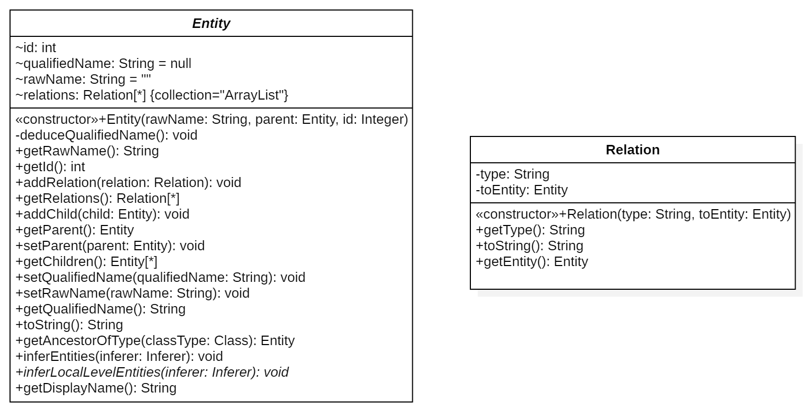
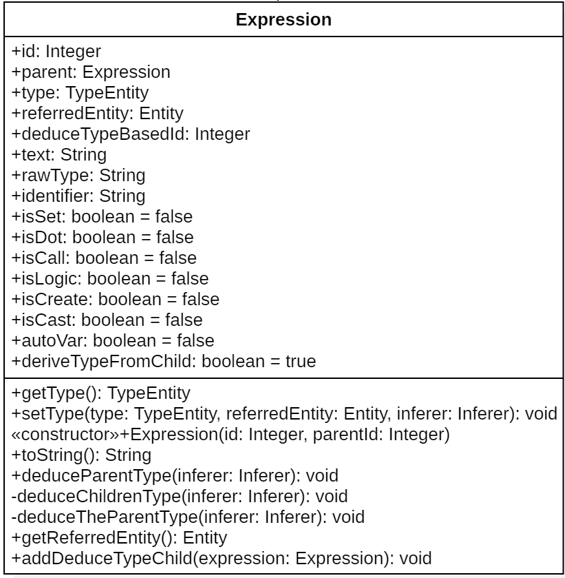
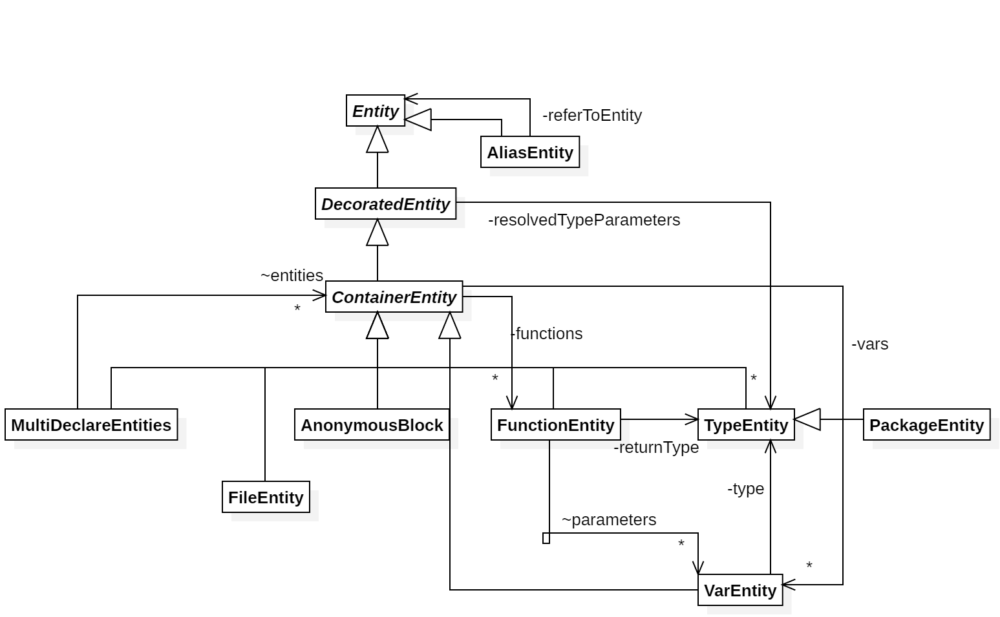
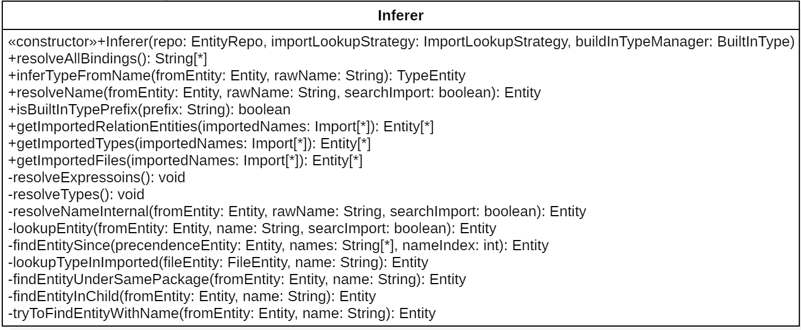
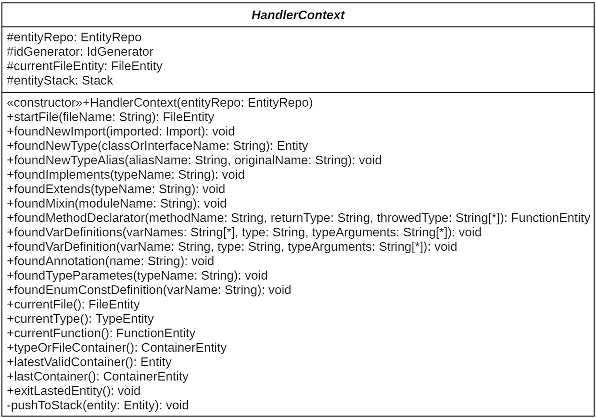
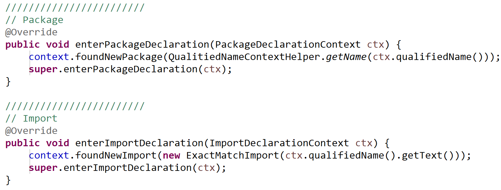

(to reader: the document is translated by google translation, it will be improved later)

Language extension description
============

Extending a new language involving the following aspects

- Register the language support for the kernel

- Implement the processor for the language

- Parser for language implementation

- Define Import lookup strategy

- Accessibility functions such as defining the built-in type of the language

This chapter first introduces the above points. Then use a chapter to explain the data structure of the language independent part, and then explain how to implement a Listener or Visitor inside the Parser to write the information that is heard.

### Step 1: Registration Language Support

In the LangRegister class, add 1 line, as shown below:

    public LangRegister() {
        /* Add a new line in LangRegister Class */
        add (new depends.extractor.python.PythonProcessor());
    }

### Step 2: Implementing the processor of the language

A language processor is a summary entry that describes everything related to the implementation of a language. Specifically include:

- the name of the supported language (string)
- the suffix name of the language file (array, there can be more than one)
- File parser corresponding to this language FileParser
- Import lookup strategy (ImportLookupStrategy) for this language
- the built-in type of the language (for statically typed languages)
- the supported relation type
 
Take the Python language as an example:

    public class PythonProcessor extends AbstractLangProcessor {
    
        public String supportedLanguage() {
            return "python";
        }
    
        public String[] fileSuffixes() {
            return new String[] {".py"};
        }
    
        public ImportLookupStrategy getImportLookupStrategy() {
            return new PythonImportLookupStrategy();
        }
    
        public BuiltInType getBuiltInType() {
            return new PythonBuiltInType();
        }
        
        protected FileParser createFileParser(String fileFullPath) {
            return new PythonFileParser(...);
        }
    
        @Override
        public List<String> supportedRelations() {
            ...
            depedencyTypes.add(THROW);
            ...
            return depedencyTypes;
        }
    }

### Step 3: Language-specific FileParser

FileParser is a language-specific class named *Lang*FileParser that implements the FileParse interface and must implement the *parse()* method.

The goal of the parse method is to read in the file, call lexical parsing and parsing, construct a Listener or a Visitor, and correctly write the parsed structure information and expression information into EntityRepo.

For details on the storage structure of EntityRepo, see the description of EntityRepo.
For example, the implementation of FileParser is as follows:

    public void parse() throws IOException {
        CharStream input = CharStreams.fromFileName(fileFullPath);
        Lexer lexer = new Python3Lexer(input);
        CommonTokenStream tokens = new CommonTokenStream(lexer);
        Python3Parser parser = new Python3Parser(tokens);
        Python3CodeListener bridge = new Python3CodeListener(fileFullPath,
                 entityRepo,inferer);
        ParseTreeWalker walker = new ParseTreeWalker();
        walker.walk(bridge, parser.file_input());
    }

The steps are:
Create a Lexer, create a Parse, create a Listener, and start traversing each of the syntax elements of interest.

### Impelemnt the listener/visitor:

First, create a context for the file:

    public Python3CodeListener(String fileFullPath, EntityRepo entityRepo, 
                                Inferer inferer) {
        this.context = new PythonHandlerContext(entityRepo,inferer);
        this.expressionUsage = new ExpressionUsage();
        context.startFile(fileFullPath);
    }
    
Then, for each code element, tell the context some information required. for example:

    public void enterFuncdef(FuncdefContext ctx) {
        String functionName = ctx.NAME().getText();
        context.foundMethodDeclarator(functionName, null, new ArrayList<>());
        super.enterFuncdef(ctx);
    }

We already succefully make the depends knows that a function entity is created.    

### Language-specific Import Locator

ImportStrategy is a strategy class named *Lang*ImportLookupStrategy that inherits the ImportLookupStrategy interface. Its role is to establish the relationship between different compilation units. Specifically, how to find a specific name in another compilation unit.

The core method of ImportStrategy is lookupImportedType(String name, FileEntity
fileEntity, EntityRepo repo, Inferer inferer). Its description is as follows:

How to find the corresponding entity out of current scope

**Parameters:**

> **name** - the entity name
>
> **fileEntity** - the current file
>
> **repo** - the whole entity repo, which could be used when necessary
>
> **inferer** - the inferer object, which could be used when necessary

**Returns:**

> the Establish entity, or null if not found

Take Java and C/C++ as examples. The implementation of Java is very simple. Since Java's import contains all the classes that import comes in, you only need to match the suffix to find a specific Entity. However, the implementation of C/C++ is more complicated. It may be a directive that uses using, which is similar to Java. However, in more cases, you should look for the symbol in the file based on the file of the import.

ImportStrategy also contains several auxiliary methods. One of them is getImportedRelationEntities. This method returns the entity that actually has an import relationship. The reason for this method is because the import relationship parsed by the parser is not necessarily accurate. For example, the import of the wildcard type in Java.

The getImportedTypes and getImportedFiles methods are responsible for returning the imported type and file, respectively. The specific functions of these two methods are only two convenience functions, which are not very necessary. In the future, reconstruction should be considered for elimination.

### Built-in type of language

The program framework will not attempt to find variables that are of built-in type, and it also eliminates the dependency analysis tool's dependency on the system's standard library.

BuildInType contains two matching methods: exact match and prefix match. Exact match such as int,
A type such as double. The prefix match includes java.lang.\*, \_\_ prefix, and so on.

It should be noted that although this method is convenient, there is a certain risk because it is not analyzed according to the range and visibility of the symbol, but it can speed up. Consider refactoring in the future.

General part of language
============

The general part of the language contains many functional modules, the most important of which are the Entity type definition, the EntityRepo and the Relation analysis.

### Entity and Relation

Entity and Relation are two core concepts defined as follows:

,{width="5.767361111111111in"
Height="2.9611111111111112in"}

Although Entity has many methods, its data structure is not complicated. The main attributes are: id,
rawName, qualifiedName, relation,
Parent and children, and the resulting ancestor-descendant relationship.

Relation is simpler, just contains the type of the dependency and the Entity pointed to. Relation is a directed relationship, pointing to the toEntity from this Entity.

Entity provides several important methods. Includes addRelation and inferEntities.
The responsibilities of addRelation are easy to understand.
inferEntities is an important method that is responsible for completing all types of bindings starting from this entity.
Resolve and type inferer.

### Expression Expression

The expression describes all the expression elements in the code. It is subordinate to its container (ContainerEntity). The expression records some data for type inference and relational calculations. its
The structure is as follows:

{width="4.276388888888889in"
Height="4.370138888888889in"}

The referredEntity attribute of the expression and the isXXX() method are combined for relational calculation. For example, if isCall is true,
And refereredEntity is object A, indicating that there is a call to A.

Expressions are stored in a hashed structure on the store, logically a tree structure, and each expression records its own parent. The type inference of an expression depends on rawType, identifier,
The isXXX() method and the parent-child relationship. For example, if the rawType is not empty or the identifier is not empty, the corresponding type can be obtained directly. If the isDot method exists, the corresponding function or variable can be obtained according to the identifier pointed to by the dot symbol (‘.’ or ‘-&gt;’), and the type of the function or variable is taken. If it's just a logical calculation, the expression should be a built-in type of true/false.

In most cases except the above, the type of expression depends on the type of its subexpression. By default it is the type of the leftmost subexpression. This automatic inference can be disabled by explicitly saying that deriveTypeFromChild is set to false.

### Entity type definition

Depends to classify the element types in the language into the following basic types: File, Package or Namespace or Package, Type, Method or Function, Variable (Var), Alias ​​(Alias), Anonymous block (Block).

Some languages ​​support multiple declarations (such as C++) or decorations (such as Ruby) on the same entity multiple times. We introduced MultiDeclareEntities to describe this concept.

The relationship between these entity types is generally inclusive, but the actual existing relationships are more complex, and will continue to be refined as more types of languages ​​are supported.

To simplify implementation, we abstracted several abstractions to simplify the types of code element entities. include:

- Entity - describes the public properties of all elements

- DecoratedEntity -
    An additional attribute describing a code element, such as a generic (template) parameter, an annotation, and so on.

- ContainerEntity -
    Descriptions can contain functions, variables, expressions, and elements of a Mix-in code element.

{width="5.761111111111111in"
Height="3.234027777777778in"}

The general relationship between the above concepts is shown in the figure above.

Among them, Entity is the public parent of all Entity, and then DecoratedEntity,
ContainerEntity. AliasEntity is essentially an alias, so it points directly to Entity.

ContainerEntity is the public parent class for most types, and its immediate subclasses include MultiDeclareEntity.
FileEntity, AnonymousBlock, FunctionEntity, TypeEntity and VarEntity.

PackageEntity is a subclass of TypeEnity. This concept is incorrect. In the subsequent stage, the design reason should be further investigated and reconstructed.

### How does EntityRepo maintain data?

EntityRepo is a global entity object database that stores all discovered software code elements. It has two HashMaps: an Id-based Map and a global name-based map to facilitate object access in different situations.

EntityRepo holds an IdGenerator to generate an Id when the object is created.

When EntityRepo finds an element with the same name, it automatically merges the elements of the same name into MultiDeclareEntities.

### Inferer's derivation

Variable resolution and type derivation are the basis for correct analysis of dependencies. The Inferer class implements two methods:
resolveName and inferTypeFromName, respectively bind the name to the correct Entity, and derive the corresponding entity type by name.

{width="5.766666666666667in"
Height="2.3777777777777778in"}

### Implicit type/object derivation

In dynamic typed languages ​​and weakly typed languages, the type of a variable has no declared type, and the type can only be derived based on the context of the expression.

There are several typical categories:

1, the variables that are explicitly new

2, variables that are assigned from other expressions

3, in the current scope (such as function parameters) can not be determined, but contains the use of information.

Depends derivate object types for different situations.

Case 1 is the simplest, just use this type directly.

Case 2 is no different from a strongly typed language. The key is the order of calculation.

Case 3 In fact, due to the existence of the DuckType feature, there is no way to calculate it accurately, but depending on the calling situation, a range of possible types can be obtained.

The specific algorithm is as follows:

1. Collect all usage information related to the variable (ie, this variable acts as a function call for the receiver, and variable access). Remove calls that do not have identifying features, such as .class,
    To\_s (in the case of ruby) such calls.

2. Retrieve all variables (for "object-oriented" languages ​​such as ruby) and types (for type-oriented) that match the usage within all visible ranges (in conjunction with the include between compilation units) before the variable is called. Object-oriented language").

3. List these types as candidates.

4. Continue to track these candidate type information, in subsequent calls (such as the continuous function call a.foo().bar(), if the path is found to be unreachable, remove the candidate type from the candidate type set.

5. The type information of the candidate set can be further guessed according to the naming situation to improve the accuracy rate.

6. Candidate types can be combined with the call situation, the occurrence in the global, naming information, etc., with a probability to indicate the possibility of the type occurring in the actual call.

The current version implements steps 1-3, and steps 4 and 5 are temporarily not implemented, leaving further extensions for subsequent versions.

Since the actual type of a dynamically typed language depends on the value of the expression, the expression should be evaluated as early as possible (Eager mode), so in depends, the expression is currently parsed in units of compilation units, in each function. The arguments are parsed in the order in which they appear. This method can satisfy most scenarios, but it is still not fine enough, for example, the variable type of the previous function comes from the return value of the latter function. The above constraints will be further refined in subsequent releases.

At the same time, Eager mode evaluation is not a required behavior for static/strongly typed languages. Quite the contrary, in some languages, the order in which the compilation units appear cannot be predetermined (for example, Java), and such languages ​​are set to evaluate the Lazy pattern, that is, the expressions are uniformly calculated in the final stage.

Depends' Inferer class contains control for both cases. In the statically typed language, set Inferer to Lazy mode, and in dynamic type language, set it to Eager.

### Implementation Restrictions {#Implementation Limits}

The functions and improvements that Depends currently knows to be implemented are as follows:

1. Function overloading: At present, it is possible to collect information about function overloading, but it does not judge the exact function call according to the calling situation. Subsequent versions should include the number and type of call parameters for accurate analysis.

2. The improvement of the aforementioned expression evaluation order.

3. The local variable at the block level in the function is the same as the variable name outside the block and the type is different. Depends has reserved the conceptual model of Block and will implement it in subsequent versions.

4. Inferer's refactoring and refinement. The current Inferer can achieve the required functions, but it is not optimal in terms of structure and needs further improvement.

5. Refactoring of Java package and file relationships.

Language front-end implementation instructions {# language front-end implementation instructions}
================

### Unqualified language parser {#Unqualified language parser}

Depends does not define the implementation of language front-end parsing from the architecture. Different languages ​​can choose the most appropriate language analysis method, such as Antlr, Eclipse
CDT, JRuby, etc.

### Responsibilities of the language front end {#Language front-end duties}

The functions that language front-end analysis needs to implement are:

1. Parse all code entities of interest

2. Parse all the expressions of interest

### HandlerContext {#handlercontext}

In order to facilitate the implementation of the front end, shielding the details that need not be understood, the general part of Depends provides a public class HandlerContext to facilitate the language parsing of the Visitor/Listener to construct the above two functions.

The structure of the HandlerContext is as follows:

{width="5.763194444444444in"
Height="4.0465277777777775in"}

The HandlerContext holds the entityRepo and an entityStack to prevent the discovered software elements from being in the correct ContainerEntity.

The foundXXX method encapsulates the internal implementation of discovering specific software elements, and the currentXXX method returns the appropriate current parsing state.

exitLastedEntity is used to maintain the entityStack.

Take the Java language as an example.

{width="5.7652777777777775in"
Height="2.185416666666667in"}

It can be found that the implementation of the language front end becomes more concise, and only needs to call the corresponding method of the context to achieve.

For each language, if you have special language elements, you should build a language-specific HandlerContext, such as Package in Java, and namespace in C++. Just put the generic language elements into the public HandlerContext.
