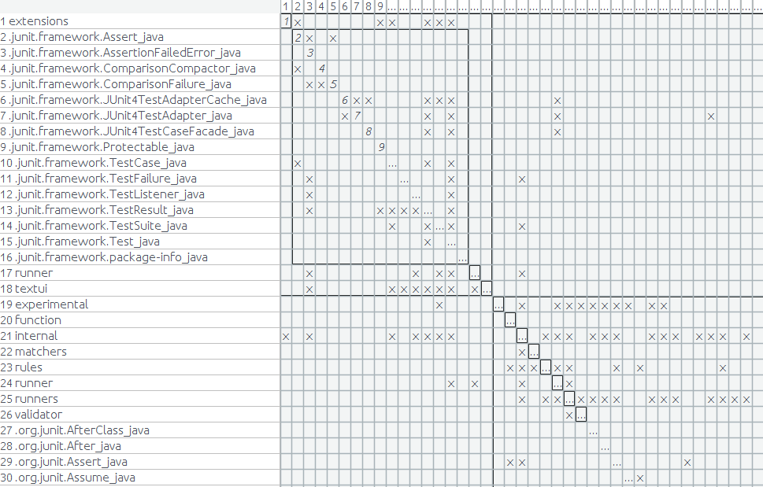
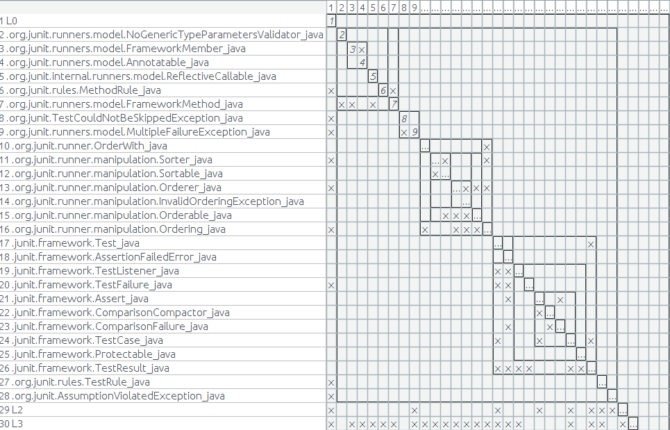
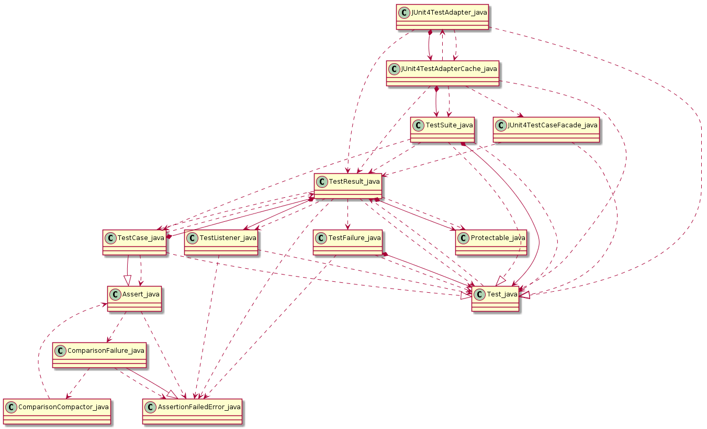
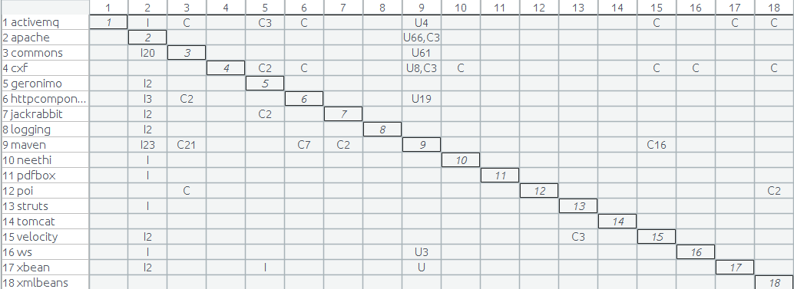
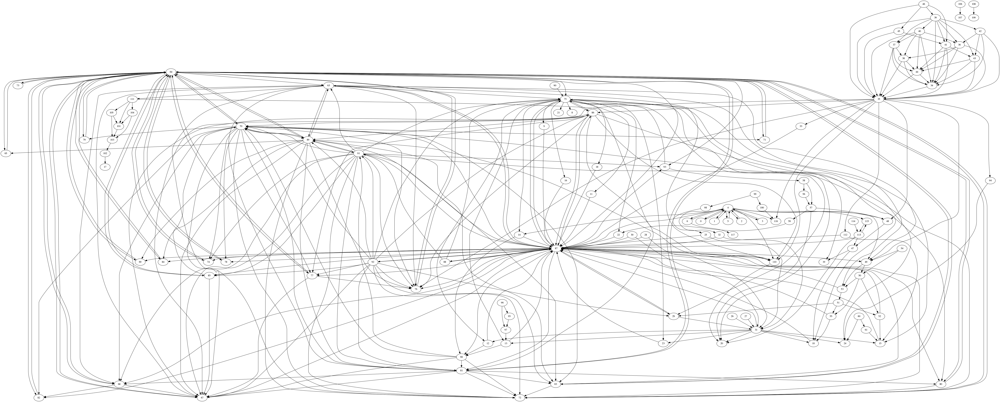

Here are some examples of result generated by *depends*:

## JUnit

A full diagram of all file of JUnit4 (https://github.com/junit-team/junit4). 

Maybe, it seems too complex. But it is actually the facts of the code itself.  The goal of  *depends* is to provide all the facts in code. 

The result could also be displayed as a matrix, like below:

It looks far better if you cluster relations based on packages. (the diagram is created use ArchiDia DV8 tool, based on the input using  json file generated by *depends*).

You may use other tools, for example DRH algorithm to get a better view of the code structure based on the data *depends* extracted. 

Certainly, if there only limited code elements involved, a UML diagram could also a good view:

## Maven

Here is a example of maven pom file dependencies generated by *depends*.

Again, the dot file version:

